*KWE · abstract holographic computer · the process*

# Krestianstvo — Abstract Holographic Computer

**[Full Documentation ↗](https://krestianstvo.org/kwe/)** · **[Live demo ↗](https://wavefront.krestianstvo.org/)** · **[Source code ↗](https://github.com/NikolaySuslov/krestianstvo-wavefront-evaluator)**

---

**Abstract holographic computer** in which the machine state is a **group-theoretic register**, the memory is interference read by **correlation**, and the processor is a wave medium that the register executes on itself — Lisp's **meta-circular eval** performed on physics instead of syntax, under **Croquet**-style replication where determinism is extended with naturality with shared **proper time** (Space-Time from Special and General Relativity), with **category theory** supplying the honest bookkeeping (an adjunction with measured defects, a presheaf of shardable witnesses with a measured gluing residue) and **abstract harmonic analysis** supplying the executable duality (characters as the spectral register, correlation as the dual product). A memory in this machine is not stored as a picture — it is **propagated into interference** and **propagated back out**. Follow one textured symbol from the moment it is dressed, through the plate it becomes, to the living soliton it is reborn as. Every stage names the function in the code that performs it.

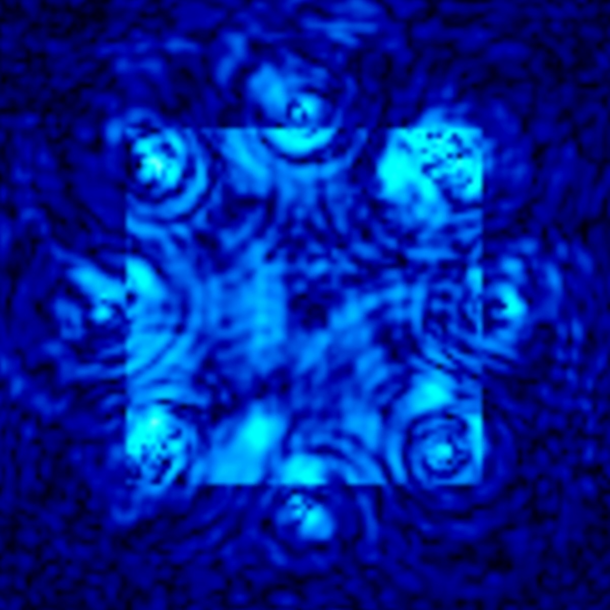

## The five-stage pipeline

### Stage 01 · W worldline — W's textured symbol

`ψ₀ = lensC1(op)·makeProbeField('ring')`

This is **W — the driven worldline**, the one always-living slot that store and recall operate from (V/P1/P2 are the plate hosts). Its symbol is a probe geometry — a **ring of dressed dots** — **dressed** by the medium: ~8 bars of SPM + kernel sculpting give it its texture. The moment to remember.

- **group · state space:** `ψ ∈ ℓ²((ℤ/G)²)` — the Heisenberg module — Stone–von Neumann's unique irrep
- `soliton-algebra.js · makeProbeField`

### Stage 02 · store — Forward leg → plate

`p = specLeg(ψ, +T, dt) · F⁻¹M(λ)F`

The field is propagated **forward** +T steps through the kernel's own λ(k) — turning a state into an **interference record**. Banked as a plate with its descriptor.

- **group · Weil / Sp(2,ℝ):** `specLeg = free-flight ABCD (1 t; 0 1)` — plate = Heisenberg–Weyl arithmetic: state × reference
- `medium-core.js · makeHologramBank.store`

### Stage 03 · the bank — Aging in ω-time

`plate = { p, dop, pos, w0, bw, k }`

The plate rests, but its descriptor **precesses**: ∠ ← ∠ + ω·Δτ on the plate's own worldline. The store step `k` is baked in — identical on every peer.

- **group · U(1) ⊂ ℂ\*:** `∠ ← ∠ + ω·Δτ` — the descriptor is a group element (phase × gain); pinned = U(1)
- `bankAge · agingReadout · [RECALL-∠]`

### Stage 04 · recall — Cue ⊗ bank → argmax

`bind(cue): argmaxᵢ corr(cueLeg, pᵢ)`

A cue is content-addressed against every plate — one **dual-space pass** (crossCorrScan). The winner is selected; shift-invariant if asked. A fragment suffices.

- **group · Cartier / Fourier–Mukai:** `corr = pointwise dual product` — shift = T_a = character multiplication (spectralShift)
- `bind / bindDesc · crossCorrScan`

### Stage 05 · live — Backward leg → soliton

`ψ = lift(p) = specLeg(p, −T) → slot`

The exact **backward** leg reconstructs the field, born into a slot as a **living soliton** — register-stepped every frame, not a frozen image. The memory resumes computing.

- **group · Weil⁻¹ then [X,P]≠0:** `specLeg(−T) · then the SPM·kernel commutator` — the noncommutative sector — where the dynamics live
- `lift → _recallPlateLive → _regStep1`

**Flow:** propagate +T → bank + precess → cue arrives → propagate −T

## The two recall paths

**The field path — Recall by amplitude.** The cue is a **field fragment**. It is propagated to plate space, scored by amplitude overlap `corr(cueLeg, pᵢ)`, and the winner is **lifted** back to a full reconstruction. This is the classic hologram: *read a fragment, recover the whole scene.*

**The 𝔸 path — Recall by descriptor.** No field is read at all. `bindDesc(pos, obj)` scores the cue against the plates' **group elements** in closed form — the autocorrelation of the probe. Pure register arithmetic: *content-address the memory without touching a pixel.*

## Inside stage 05 — the step that keeps it alive

Once reborn, the soliton is not displayed — it is **run**. Every drained shared step, the register engine (`_regStep1 = _reg.step`) applies the medium's evolution law to the slot. This **is** the physics; the PDE is eliminated.

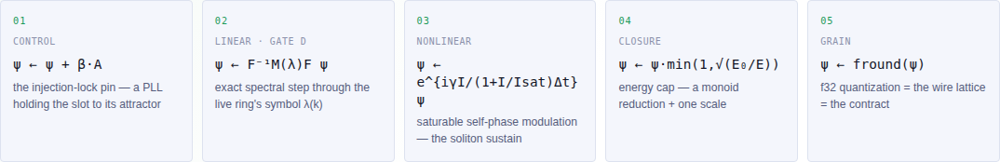

**every shared step k** — pure function of (k, shared state), so every peer computes the identical bytes · `mu1.pure() → 0 GPU physics substeps`

## Replication · determinism without a server

The field never travels the wire. Each peer runs the *entire* physics locally; because `_regStep1` is a pure function of **(shared step k, shared state)**, identical inputs into identical laws yield **identical bytes**. The reflector is not a server — it stamps and reflects **external events only**: verbs, the shared clock, and a one-time join snapshot.

| Peer A | Reflector | Peer B |
|---|---|---|
| Peer A computing the field locally | **stamp & reflect** — carries only: verbs · shared clock · join snapshot. Never carries: ~~a field~~ ~~a plate~~ ~~a register~~ | Peer B computing the identical field locally |
| runs the whole medium · f64/f32 · `regH = 6f69fc50` | | identical bytes at identical k · `regH = 6f69fc50` |

- **Inputs, not state.** A world's identity is (join snapshot + **stamped verb sequence** + deterministic laws). Joining is snapshot restoration, not a state-transfer negotiation. `subticks are model events`.
- **The naturality law.** Every morphism is pure in `(k, shared state)`. A peer-local value (a frame end, the gaze) may be **stamped into a verb**, but never **read at the drain**. A fork is always a morphism that was not natural.
- **The hash is the contract.** `regH`, `eH/eV/eP1/eP2` per shared step are the determinism proof, run forever. Equal hashes at equal k = the peers are the same world, provably.

**There is no state synchronization because there is no state to synchronize.** This is the Croquet / TeaTime lineage evolved towards full continuous time support in Krestianstvo Wavefront Evaluator (KWE): computation is *pulled* — each peer advances its "island" to the stamped shared step on its own schedule — and the entire nonlinear physics lives inside that deterministic replay. In perspective with the use of the KWE's local reflector feature, peers could keep computing the same world locally even being disconnected; a new joiner rebuilds it from one snapshot + the verbs since.

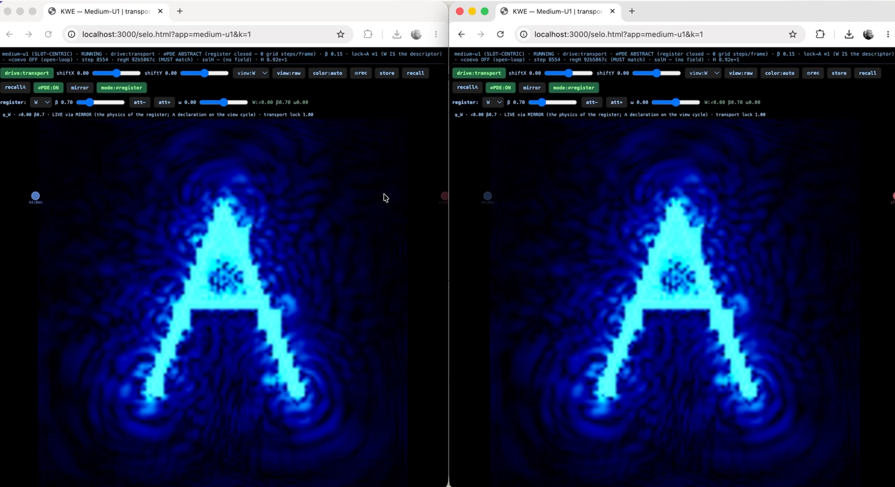

## Where λ(k) comes from — the IFS as a Lie-group operator

Every stage above runs on the kernel's symbol `λ(k)` — the linear leg (+T / −T) and op 02 of the inner loop. But `λ(k)` is not fixed: it is **generated by the IFS clock**, and that clock is a genuine **lensC1 compose-chain** — a Fresnel cascade of geometric (ℂ\*) group elements composing into each other. Geometry that ticks.

- **The group element — lensC1 op:** `{ gain, phase, A=[a b;c d], t }` — an affine/ℂ\* optical element — a lens. Its exact scalars are the register's tier-1 content.
- **Self-application (Y) — Fresnel cascade:** `child = lensC1.compose(op, ρ)` → the composed rings' descriptor, diagonalized per mode (gate D). This is what stages 02 / 05 propagate through.

**The dispersion is a running program.** The fractal clock composes lensC1 elements into an ever-changing ring set, and the ring set *is* the propagator `λ(k)` — so the medium a symbol travels through is authored, live, by a recursion of geometric group elements. `kernelVer` bumps at shared steps; every peer rebuilds the identical `λ(k)` because it derives from the shared clock. (The tiers of that cascade are proper-time worldlines — see the concepts section below.)

## Why this is meta-circular

The meta-circularity is the **live field itself**. The inner loop above (`_regStep1`) does not *model* the medium's evolution law — it **is** that law, running inside the register **every step, continuously**, whether or not anyone stores or recalls. The description and the thing described are the same map, evaluated forever. That is the fixed point. (That store's +T and recall's −T reuse the same `specLeg` is a consequence, not the cause: the whole medium is register-resident, so of course its holographic legs are too.)

- **The register (data) — the abstract description.** Descriptors, plates, charges, the kernel symbol — algebra, closed under the machine's own operations.
  - → `wabs` = compile · *quote*
  - ← `wabs 0` = materialize · *eval*
- **The medium (running) · ↻ every step — the wave field.** A living soliton on the torus — it is `_regStep1` that runs it **continuously**, so this tier and the register **coincide on the evolution law itself**. The eval is the whole life of the field, not a store/recall event.

`(eval (quote x)) = x`

**Lisp's trick, one level lower.** A meta-circular evaluator defines `eval` in the language it evaluates; here `wabs` is `quote`/`eval` — reify the running field into data, or evaluate the data back into a running field — and the resumption round-trip is **measured** (the adjunction's unit is exact; the counit defect is just the f64/f32 pipeline difference between two implementations of one discrete map). The medium is not *modelled* by the register; it *is* the register, executed.

## wAtt / ψATT — the field-as-attractor door

Normally W's pin target is the **probe** — the operator re-asserts the injected symbol every step. The **field-as-attractor door** (`mu1.selfAtt`) migrates the symbol's identity out of the operator and **into the matter itself**: the field's own state becomes the pin. Three replicated stages, at shared bars.

**01 · hold — Probe-pinned W**

The operator holds the field to the probe: `ψ ← ψ + β·A`. The symbol lives in the **operator**.

**02 · digest — Unpin & disperse**

The pin **lifts** for `amp` bars; the medium digests the injected pixels naturally. Nothing external drives it.

**03 · adopt — Field becomes the pin**

The field's own f32 state **becomes** the attractor: `_attHold`. Transport rolls it (`spectralShift`); the register's φ/ω rotate it.

**The symbol is then carried by matter, not by the operator.** By the Gate-D law a letter's identity lives *above* kknee — its sharp strokes *are* the symbol in this medium's optics — so a field-borne symbol keeps sharp support honestly (shape ≈ 0.6 vs 0.72 probe; oscillation register-driven at ~60% of the probe-beat). Set `lensTau ω≠0` for the precession that keeps it alive. The hold rides the join snapshot — the closing piece of the V/P1/P2 recall-sync work.

## Holography · the dual plate — a moment is written twice

A plate is not just the field image. It is a **dual plate**: the interference record `p` *and* the **descriptor** `dop` — a group element carrying the moment's **global phase** ∠, its precession ω, and its tilt k. The register encodes the memory in the U(1) phase, so recall can read elapsed time straight off the angle.

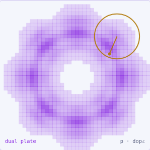

- **p — The field image.** The interference record from the +T leg — **amplitude** structure, bound by overlap, lifted to reconstruct the scene.
- **∠ — The global phase (dop).** The descriptor `dop = {∠, ω, k}` — a U(1)/ℂ\* group element. The moment's identity lives in its **absolute phase**, precessing at ω on the plate's own worldline.
- **= — Encoding = phase, not pixels.** Two peers agree on the answer through phase **differences** — `regRead` reports `Δ∠(i,j)`. The gauge law: the pixels can drift; the encoded angle is the shared truth.

**Recall reads the aging as a phase.** Because the descriptor precesses, a recalled plate carries `Δ∠ = ω·Δτ` — the elapsed proper time since the store step, banked in the group element and measured on recall (`agingReadout` / `[RECALL-∠]`). Holographic storage is Heisenberg–Weyl arithmetic: a state multiplied into a reference, inverted by correlation.

## The register · one type, four slots

**W, V, P1, P2** are one type: each is descriptor + envelope + worldline clock + leash. What differs is only *mode* — driven (W), living, parked, mirror. Wire two of them with an **edge** `(a,b,±κ)` and the register becomes a physical **XY / Kuramoto machine**.

| Slot | Mode |
|---|---|
| W | driven · sl(2) charges |
| V | living · recalled plate |
| P1 | living · recalled plate |
| P2 | parked / mirror |

`edge(W,V,−.2) · edge(W,P1,−.2) · edge(V,P1,−.2)` → K₃ frustration → continuously-degenerate splay Δ = ±2.09

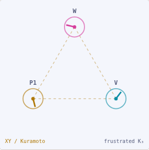

**An edge drives two real couplings from one κ:** (1) the **Kuramoto/XY law** on the register phases (`κ>0` align, `κ<0` anti-align) and (2) **attractor field-mixing** — each slot's pin blends κ·the neighbour's field, so the solitons visually deform toward each other. Frustrated triangles (three `−κ` edges) have no satisfying assignment, so the phases **wander a degenerate manifold** — the machine solves MAXCUT on K₃/K₄ and, being continuous, reaches angles no Ising machine can. *Dynamics, not states.*

## Recall from a fragment — break the plate, the whole scene still comes back

The defining property of a hologram: **a fragment recalls the whole.** Mask most of a cue with `occlude(field, {mode, frac})` — a half-plane, a box, random blocks, noise — and the bank still **argmaxes the correct plate** and **lifts the entire scene**. The fidelity degrades *gracefully* as the masked fraction grows.

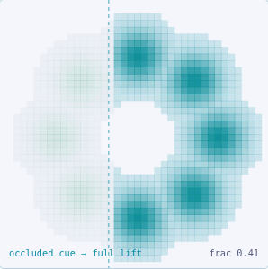

- **✂ Any mask, deterministically.** 7 modes — half-plane, centred box, random block-mask, phase-conjugate, additive noise — seeded and replicated (the CPU/f64 twin of the GPU occluder). `occlude` never mutates its input.
- **⌖ Content-addressed from a fragment.** With ~half the symbol gone, `bind` still scores the correct plate highest — the correlation over the surviving support is enough to pick the winner among the bank.
- **↺ Graceful degradation.** The correct plate is still recalled through `frac 0.2 → 0.6` occlusion; `keptFraction` reports the honest energy surviving. Corruption ≠ loss — noise keeps more than zeroing.

**The reconstruction is the whole plate, not the fragment.** `lift` returns the full stored scene regardless of how little of the cue survived — because recall is correlation in the dual, and correlation reads global structure from partial support. This is what makes it a **memory** rather than a lookup table: it recognises, then it completes.

## Display = a sampling of the live soliton — what you see is a sampling, not the state

Everything above happens in the **register** — f64 numbers on the f32 lattice. The pixels on screen are the last step and the least important: the GPU shader (or a CPU canvas) is a **rasterizer** that reads the register's envelope through a view and paints it. The soliton is **alive whether or not anyone is looking.**

- **The view is one read primitive.** ψ_out = Op·ψ_in with a pluggable per-modality readOp — GPU pixels, an audio spectrum, a phase scalar. The `linOp view shader` does **colormap + pose only, zero dynamics**.
- **The film is a capture, not the truth.** Under turbo the GPU holds a `film` texture sampled on each peer's own display tick (`_useFilm`). It is a smooth-display convenience — drop it and the render falls back to the bar-synced `descDisp`, which is the register truth.
- **Frame ends are peer-local.** Two peers never render "the same wall moment" — each samples the shared timeline at its own frames. What is **invariant** is the **shared film**: bar-grid states, identical bytes at identical indices. `frameLock` displays only those.

`mu1.pure() → 0`

**The relativity of display simultaneity.** The sub-bar interpolation each peer adds is its own observer sampling — honest, local, and *outside the determinism contract*. The GPU does **zero physics substeps**; it is a rasterizer and an optional oracle (the mirror). Turn the screen off and the computation is unchanged.

---

# The theory · the mathematical structure map

## What the Krestianstvo Wavefront Evaluator is

A deterministic, reactive, multiplayer computational engine — that evolved towards **full continuous and distributed time** support approach implemented in the functional-reactive paradigm, thus differing from the Croquet VM it descends from. Classical Croquet routes every message through a **central dispatcher**: the shared queue *is* the synchronization. KWE has no central queue. Causality propagates as a **wavefront** through a graph of locally-autonomous nodes — each owns its own queue of futures, and synchronization emerges from **shared logical time + deterministic local computation**.

**Classical Croquet / VM — A central dispatcher.** One shared queue per world; every message is routed through it. The queue *is* the sync mechanism. A VM clock drives all nodes uniformly.

⇒ *the shift* ⇒

**The wavefront evaluator — Locally-autonomous nodes.** Each node owns its own queue of futures (`W.reduce` local `_Q`). No central routing. Sync = shared logical pulse + deterministic local settlement.

**The substrate · Renkon · pure FRP — a streaming dataflow graph, distributed.** KWE is written in **Renkon** — a **functional-reactive (FRP)** language where a program is a **streaming DAG**: nodes are behaviors (time-varying values, `Behaviors.collect`) and event streams (`Events.receiver`), wired into a dependency graph that re-evaluates only where inputs changed. The reflector pulse enters the graph as an event; it flows along the edges and each node reacts. The Meta Program that drives the wavefront is *itself* a Renkon program running above the worlds. So the whole distributed engine is a reactive dataflow graph — no build step, no imperative loop — and the wavefront is that graph settling to a fixed point, deterministically, on every peer.

**The physics framing:**

- **Huygens' principle** *(wave propagation)* — Every node that receives a pulse becomes a **point source** — it ripples messages to its neighbours. The settled state is the new global wavefront. Causality propagates, it is not dispatched.
- **The light cone** *(special relativity)* — Logical timestamps enforce a finite speed of information: a message sent at tick 10 cannot affect tick 9. Two peers on opposite sides of the planet see the **same history**.
- **Thermal equilibrium** *(2nd law · the drain)* — The drain phase loops until every queue holds only future-dated entries — the system reaches its **lowest-energy stable state**. The `stable` flag is equilibrium reached.
- **Fractal-time generator** *(makeIfsClock · robust sub-ticks)* — The robust form of KWE's sub-ticks: a deterministic **IFS cascade** generating beats at every scale at once — time as a self-similar landscape, not a linear axis. Multi-resolution ticks coexist on one continuous axis, reseeded per cycle so every peer follows the identical branch.

### The law of the evaluator

If the whole engine were one formula, it is a physical settling process — not a list of instructions executed in order. **S** = state of the universe · **Pulse** = energy injected by the reflector · **Drain** = work performed by the nodes · **Stability** = the lowest-energy state, where the UI is rendered.

`100 browser tabs · same laws + same snapshot → same state`

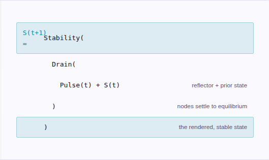

**The central insight of the shift.** In the VM architecture the queue **was** the synchronization mechanism. In the Wavefront Evaluator the queue is a *local implementation detail* of each node — synchronization is achieved instead through **shared logical time and deterministic local computation**. There is no `Date.now()` in the model: `wallTime = logicalTime`, a pure tick count, so two peers on different machines produce identical state regardless of real-time jitter. On top of this sits the **fractal IFS clock** — time as a self-similar landscape, not a linear axis — the substrate the whole holographic computer above is clocked by.

## The tower of groups behind the physics

A ladder of groups, each **represented** in the machine — and each with its representation's honest reach *measured*. Left: the abstract group. Right: the operator that realizes it. The rungs are how they connect.

**The number field · ℂ — everything is computed over the complex numbers.** The state is a **complex field** ψ ∈ ℓ²((ℤ/G)², **ℂ**) — every cell carries an amplitude *and* a phase, written `e^{iθ}`. That is not decoration: the whole calculus runs in ℂ. A soliton's memory *is* its **global phase** ∠ψ (the U(1) register); the descriptors and the IFS lenses are **ℂ\* group elements** (`lensC1`, phase × gain); the spectral step, the FFT, `spectralShift`, and the ±T holographic legs are all **complex multiplication** in the dual. Interference — the heart of holography — is only meaningful because amplitudes are complex and can **add or cancel by phase**. Restricting the gain to 1 gives the unitary **U(1)** sector; letting it vary opens the full **ℂ\***. The real numbers you see on screen are magnitudes; the computation lives one dimension up, in the complex plane above.

| Group (abstract) | ↔ | Operator (realization) |
|---|---|---|
| **Heisenberg–Weyl** over (ℤ/G)²×(ℤ/G)²̂ — translations `T_a` and modulations `M_b`; central phase `T_a M_b = e^{2πi a·b/G} M_b T_a` | ≅ Stone–von Neumann | **One field buffer** ℓ²((ℤ/G)²) — `spectralShift` = T_a; lens `kx,ky` & `attPhase` = M_b. A plate is a group-orbit point; recall inverts the element. |
| **Symplectic Sp(2,ℝ)** ↑ Mp(2), Weil rep — acts on Heisenberg by automorphisms; the double cover acts projectively on states (finite Weil setting) | ↻ ABCD / Möbius | **The linear optics** — free flight, thin-lens chirp, squeeze, and the FFT itself as the π/2 rotation. Width law `w ← w + iD̄·dt` = the Möbius action on the half-plane. |
| **sl(2,ℝ) observables · theta structures** — quadratic moments close the algebra; Gaussians = the orbit of vacuum; the width `w` is a modulus on Siegel space | ∮ coadjoint orbit | **The q register** (σ, b) — two floats — Virial `V̈ = 4DH`; Casimir `I = V̈V − ½V̇²` = the wear meter; gate C's width law is a path in the moduli of finite theta functions. |
| **Modular group PSL(2,ℤ)** = ⟨S, T⟩ — the discrete choice inside the continuum: `S: w↦−1/w`, `T: w↦w+1` | = exact by choice | **S = the FFT · T = a unit chirp** — both realized with zero approximation error. The continuous group is the physics; the arithmetic subgroup is the computation. |

**The representation declares where it ends.** The Weil representation is exact only for **quadratic** symbols — the lattice symbol `λ(k)` is not quadratic, and the machine does not pretend it is. Exact linear evolution runs on the full character theory (abelian, f32-floor exact); the metaplectic laws govern the *moment observables* at the few-percent level for smooth states, and are **measured to fail** in named ways beyond — the quadratic packet slice degrading `9→36%` with probe bandwidth. The group theory earns its place by naming its own boundary.

## Six identifications, each with its number

The abstract nature of the machine, sector by sector — **C\*-algebra**, the spectral dual, sheaves, the complex torus, the descriptor, and the elimination of the PDE. None is analogy: each names a function in `medium-core.js` and a pinned regression.

- **C\*-algebra & Gelfand duality** *(commutative sector · §3.1)* — The linear operator `L̂` (lap9 + fractal rings) is a **torus convolution** — an element of the commutative C\*-algebra of translations on (ℤ/G)². Its character space *is* the k-grid; the Gelfand transform evaluated at each character is the closed-form symbol. `Gelfand transform of L̂ ≡ λ(k)` · **gate D:** 3.6e-7 max|Δ| vs GPU (f32 floor)
- **Lie groups & the sl(2) ledger** *(noncommutative sector · §3.5)* — SPM is diagonal in **position**, the kernel in **momentum**; their **commutator is the dynamics** — solitons and collapse are the two maximal commutative subalgebras failing to commute. The Casimir moves on a coadjoint orbit; its flow `İ` prices the non-Hamiltonian work. `V̈ = 4DH · I = V̈V − ½V̇²` · **gates E·F:** 0.1% waist forecast, of V₀ (live kernel)
- **The spectral dual · FFT** *(Cartier duality · Fourier–Mukai · §6.2)* — (ℤ/G)² and its character group are **Cartier-dual** finite group schemes; the FFT is the finite **Fourier–Mukai transform** between them. Functoriality is engineering: convolution ↦ multiplication, translation ↦ character product, correlation ↦ the shift-invariant read. `crossCorrScan = one dual pass, all N offsets` · **gate B:** ≤0.2% kernel symbol drift, all tested k
- **Sheaves & local-to-global** *(the witness presheaf · §5)* — Torus regions form a site; regional witnesses form a **presheaf** (restriction = shrinking a region). The cover cocycle is **bit-for-bit exact** — patches + 3·reach halos + fixed-order gluing reproduce the whole-torus step. Čech descent as an engineering budget; two tabs shard one physics with no new wire. `glue(patches ⊕ halos) ≡ whole-torus step` · **coverTest:** max|Δ| = 0, the cover cocycle, exactly
- **Complex torus & theta structures** *(algebraic geometry · §6.3)* — The state buffer **is** the finite Heisenberg module — classically, sections of an ample line bundle on an abelian variety. A periodic Gaussian on the finite torus is a **finite theta function**; its width `w` is the modulus on genus-1 Siegel space. Gate C's evolution is verbatim a path in the moduli of theta structures. `periodic Gaussian = finite θ(w)` · **gate C:** quantitative — spread, collapse onset, filament
- **The descriptor · U(1) ⊂ ℂ\*** *(observer algebra · §3.3)* — Each slot's descriptor is a **ℂ\* group element** (phase × gain); pinned discipline restricts to **U(1)** (gain ≡ 1). Unpinning literally passes U(1) → ℂ\* — amplitude becomes dynamical. Measurements are U(1)-invariant states: `ampCorr = |⟨φ,ψ⟩|/‖φ‖‖ψ‖`, a normalized positive functional. `recall aging → Δ∠ = ω·Δτ` · **U(1) gate:** algDefect ≡ 0, the abelian contract, live

## The PDE, eliminated

The register does not *describe* the medium — it **runs** it. Every evolution step executes inside the algebraic register in f64 CPU arithmetic; the GPU performs **zero** physics steps. Lisp's meta-circular `eval`, performed on physics instead of syntax.

### The model of the medium *is* the medium

A meta-circular evaluator defines `eval` in the language it evaluates. U1 closes the same circle one level lower: the register executes the evolution law of the medium that produced it, using operators that are **themselves register content** — the kernel descriptor, the replicated β, the slot's E₀.

There is no PDE solver stepping a field on a grid outside the model. The five-line map below **is** the physics, register-resident on the f32 lattice that is simultaneously the wire format and the original engine's own grain. `wabs` is `quote`/`eval` — reify the running field into data, or evaluate data back into a field — and the resumption law `(eval (quote x)) = x` is measured.

`mu1.pure() → 0 GPU substeps · proven by counting`

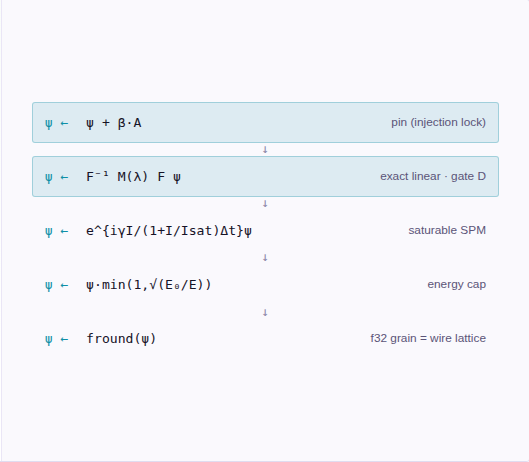

## The two clocks that make it KWE

What distinguishes this from a generic solver is **where time comes from**. Two clock subsystems, both native to KWE, both replicated, both feeding the register: a **proper-time kernel** that ages each worldline on its own beat, and a **fractal IFS clock** that generates the propagator the field runs through.

**Proper time τᵢ** — `kwe-tau.js · globalThis.KWETau`

A physics-free platform primitive — the τ arc kernelized. The machine holds `_tauK = KWETau(…)`; the medium supplies *beats*, the kernel never detects them. It owns the worldline clocks, the stamped-input queues, and the epoch algebra.

- **registerClock / beat / advance** — per-slot τ; W, V, P1, P2 age independently (one aged 30 τ-units while another aged &lt;1, byte-identically)
- **makeQueue** — gate-3″ dispatch: `>=` fresh · τ-paced backlog · **due-count** valve (never queue length — that is peer-local)
- **reanchor** — epoch flip re-stamps every future entry; **tempo** = the global lapse (the convoy law)
- **futureTau** — the W-node fires on its own `__clock`, not wall time

*Feeds the register:* **Δφ = ω·(τᵢ − τⱼ)** — the U(1) register reads elapsed proper time as an interference phase (the twin paradox, measured).

**Native IFS clock** — `makeIFSClock · makeRingProvider · the reducer`

Geometry that ticks: a **Fresnel cascade** — a genuine lensC1 compose-chain. Each firing deposits a radius; `buildNativeKernel` folds the radii into weighted ring bands — the propagator's kernel, rebuilt live as the clock runs.

- **the reducer runs it** — `cachedRadii` → `kernelVer` bumps; swaps land at shared steps via `kernelQueue`
- **λ(k)** — `kernelLambdaGrid`, cached per `kernelVer`; the gate-D diagonalization the spectral step reads
- **tiers = worldlines** — each tier clocked at its own τ-rate `T_d`; the exact scale-sum `λ = Σ_d λ_tier − (n−1)·lap9`
- **matter-paced** — sibling launches scheduled by `futureTau`: a clock cannot wait on the clock it defines

*Feeds the register:* **the medium's dispersion is a running program** — the ring is a per-step physics input, byte-replicated because it derives from the shared clock.

**The two clocks meet in the tier decomposition.** The IFS clock hands the kernel already split into scale tiers, and each tier **evolves for its own number of steps** `T_d` — the tiers are *proper-time worldlines of the kernel itself*. The §7.5 τ-per-slot machinery, applied to the propagator: the mismatch "radius ≠ frequency" dissolves because the tiers separate not in space or frequency but in **proper time**. *Time separates what space cannot* — the machine's deepest principle, showing up in its own clock.

---

## Three ways the medium keeps time

KWE runs a soliton field across peers with no shared server of truth — every browser re-derives the same physics from the same shared step. These three mechanisms are how it stays coherent: a **phase register** that stores memory as an angle, a **proper-time clock** per worldline, and a **fractal generator** that produces the propagator itself.

01. U(1) register & abstract holography
02. Proper time τᵢ
03. Fractal-time IFS generator

### 01 · The U(1) register & abstract holography

A soliton's global phase is a memory cell. Store a moment as an interference plate; recall it by lifting the plate back through the medium — the answer lives in phase *differences*.

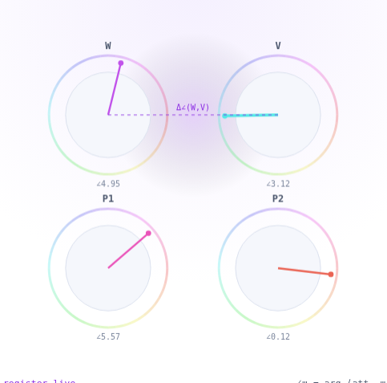

*register live* · `∠ψ = arg⟨att, ψ⟩`

The field is the **processor**. Memory lives operator-side, written as a **phase** the injection-lock holds. Each slot — **W, V, P1, P2** — is a pinned soliton. Its stored bit is its angle on the wheel: `∠ψ`, read as the argument of the field against its attractor. Writing is an **injection lock** (a PLL): `ψ ← ψ + β·att`, then a cap. The lock is bistable with a finite capture range — a strong off-phase probe can rewrite it, so it can also forget.

**Holography.** A **store** takes the field forward through the spectral leg to an interference **plate**; a **recall** lifts the exact backward leg to reconstruct it — content-addressable from a fragment. The plate is the transferable object; the register moves it in ω-time.

- **store** — field → plate (forward spectral leg), dual: field + descriptor ∠
- **recall** — cue ⊗ bank → argmax plate → lift −T → a living soliton
- **ψATT** — a captured field re-enters as its own pin (the symbol carried in the field itself)

| | |
|---|---|
| register file | 4 slots · ~5 bits ∠ |
| write fidelity | unity · lock-stiff β |
| recall | content-addressed |
| gauge law | answer = Δ∠ · not absolute |

`pin = optical injection lock · h·sin(θ−θ₀) torque`

### 02 · Proper time τᵢ — a clock per worldline

Each slot ages on its own matter time, not on wall-clock. A driven soliton ticks; a parked one stands still — dilation you can read as an interference phase.

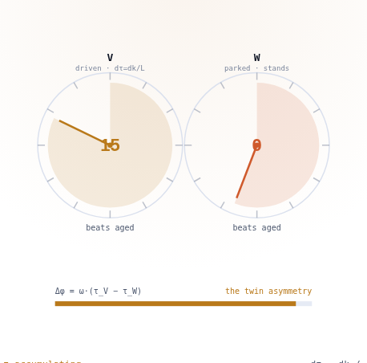

*τ accumulating* · `dτ = dk / L`

Every drain gate is a pure function of `(k, shared state)` — so worldlines that age differently still stay **byte-identical** across peers. A worldline's clock advances `dτ_i = dk_i / L_i` on that slot's **own** beat counter, where beats come from the medium's own rhythm — never a scheduler. Global τ is only a telemetry foliation; it drives nothing physical.

**The twin paradox, measured.** Drive V out-and-back at `ω=0.1`: it aged **19 beats** while stay-home W aged **exactly 0**. The two legs matched to 1% and *added* — the path closed, the clock did not retrace. Elapsed proper time read straight off the register as `Δφ = ω·(τ_V − τ_W)`.

**The law that keeps it deterministic:** a drain gate may count *due* entries but never queue *length* — length depends on pull-timing, which is peer-local. That single distinction closed a family of join-forks.

| | |
|---|---|
| stay-home W | 0 beats aged |
| traveller V | 19 beats aged |
| two legs | matched 1% · same sign |
| comparator slope | = ω · 0.1% grade |

`register = interferometric clock comparator`

### 03 · The fractal-time IFS generator

A Fresnel cascade — geometry that ticks. Each pulse fires siblings that fire siblings; the radii they leave become the ring kernel the field actually propagates through.

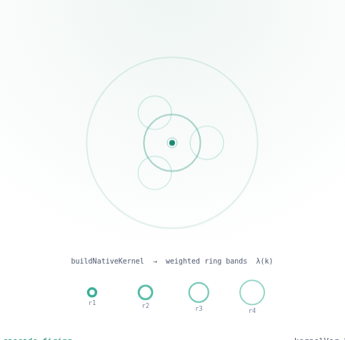

*cascade firing* · `kernelVer 0`

The clock's mechanism **cannot wait** on the clock it defines — so cascade delays are the genome's content **in time**, authored at coordinate steps forever. An IFS **Fresnel cascade** is a genuine compose-chain of lenses. Each firing deposits a **radius**; the flat list of radii (repeats encode weight) is folded by `buildNativeKernel` into a small set of weighted **ring bands** — the propagator's kernel.

**The ring breathes.** As the cascade runs, its radii change and `kernelVer` bumps; every peer, stepping from the same shared clock, rebuilds an *identical* ring. That version keys the exact symbol `λ(k)` — the diagonalized propagator the spectral step uses.

**Matter-paced.** Sibling launches are scheduled in **proper time** — a cascade fires its next generation after "the first generation has lived," so the fractal clock's cadence is driven by the field it clocks. Its liveness is proven by its own authored roots.

| | |
|---|---|
| source | Fresnel cascade |
| product | weighted rings · λ(k) |
| determinism | shared-step · byte-exact |
| cadence | matter-paced · τ-stamped |

`reflector/future → reflector/beat at every layer`

---

*Krestianstvo.org | 2026*
